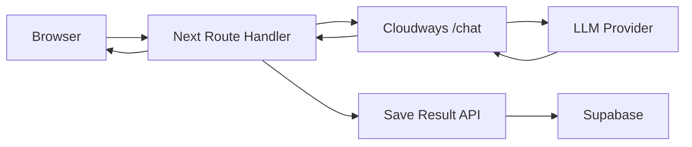

# Cloudways 서버프로그램 역할과 Yeonun 반영 설계

## 1. reunionf82 Cloudways 서버의 역할

### 1.1 점사 스트리밍 서버

근거 파일:
- `C:\Users\goric\reunionf82\cloudways-server.js`
- `C:\Users\goric\reunionf82\cloudways-streaming-config.js`
- `C:\Users\goric\reunionf82\cloudways-html-safety.js`
- `C:\Users\goric\reunionf82\app\api\jeminai\stream-proxy\route.ts`

역할:
- Express 서버가 `/chat` 엔드포인트를 노출한다.
- Vercel 함수 타임아웃을 피하기 위해 Cloudways에서 장시간 LLM 호출을 수행한다.
- `req.setTimeout(1800000)`, `res.setTimeout(1800000)`, `app.timeout = 0`으로 장시간 요청을 허용한다.
- Gemini 모델을 호출하고 SSE 형태로 스트리밍한다.
- 결과 HTML을 안전하게 자르기 위해 `ITEM_START`, `ITEM_END` 마커를 사용한다.
- 테이블 내부에서 자르지 않도록 `cloudways-html-safety.js`가 HTML 경계를 보정한다.
- 1차 응답이 길거나 미완성일 경우 2차 요청 결과를 병합하는 유틸이 있다.

### 1.2 음성 Live 프록시 서버

근거 파일:
- `C:\Users\goric\reunionf82\scripts\vertex-live-proxy-server.js`
- `C:\Users\goric\reunionf82\pages\api\voice-mvp\live-proxy.ts`
- `C:\Users\goric\reunionf82\docs\vertex-live-proxy-cloudways-checklist.md`

역할:
- WebSocket 서버를 띄워 브라우저와 AI Live API 사이를 중계한다.
- Gemini Live, GPT Realtime, xAI, Hume EVI 등을 모델명 기준으로 라우팅한다.
- 오디오 base64, 텍스트, interruption, session resumption, goAway 이벤트를 클라이언트로 전달한다.
- Vertex AI Live는 프로젝트/리전/서비스 계정 키가 맞아야 하며, Cloudways에서 pm2로 프로세스를 관리한다.

## 2. Vercel 타임아웃 우회 방식

- Next.js API는 요청 검증과 스트림 중계만 담당한다.
- Cloudways가 실제 장시간 LLM 스트리밍을 처리한다.
- 클라이언트가 이탈해도 Next Route가 Cloudways 응답을 끝까지 읽고 저장 라우트를 호출하는 패턴을 사용한다.
- SSE heartbeat(`: ping`)를 사용해 중간 프록시 버퍼링/끊김을 줄인다.

## 3. Yeonun 적용 설계

### 3.1 Claude 4.6 Sonnet 점사 프록시

Yeonun에서는 Gemini 대신 Claude 4.6 Sonnet을 사용한다.

권장 엔드포인트:
- Cloudways: `POST /fortune/stream`
- Next.js: `POST /api/fortune/stream`
- 저장: `POST /api/fortune/complete`

현재 Yeonun에 반영된 엔드포인트:
- `src/app/api/fortune/stream/route.ts`
  - `CLOUDWAYS_FORTUNE_URL` 또는 `CLOUDWAYS_URL`로 Cloudways Claude 스트리밍 프록시 호출.
  - `CLOUDWAYS_PROXY_SECRET`이 있으면 Bearer 토큰으로 서버 간 인증.
  - `fortune_requests` 테이블이 있으면 요청 상태를 `streaming`으로 기록.
- `src/app/api/fortune/complete/route.ts`
  - Cloudways/프론트가 완료된 HTML을 `fortune_results`에 저장하고 `fortune_requests.status`를 갱신.

Cloudways 책임:
- Claude API 스트리밍 연결 유지.
- 요청 payload 검증.
- 점사 HTML 청크 생성.
- `ITEM_START`, `ITEM_END` 같은 완료 마커 삽입.
- HTML 경계/테이블 경계 보정.
- 2차 요청 또는 재시도 병합.

Next.js 책임:
- 관리자/사용자 권한 확인.
- `fortune_requests` 생성.
- Cloudways로 요청 전달.
- 브라우저에 SSE 전달.
- 스트림 종료 후 `fortune_results` 저장.

### 3.2 음성상담 프록시

권장 엔드포인트:
- Cloudways WebSocket: `/voice/live`
- Next.js 세션 API: `/api/voice/sessions`, `/api/voice/sessions/[id]/turn`, `/api/voice/sessions/[id]/end`

Cloudways 책임:
- 브라우저 WebSocket과 AI Live API 중계.
- 오디오 chunk, 텍스트 transcript, interruption 이벤트 전달.
- 세션 재개 토큰 관리.

Next.js 책임:
- `voice_sessions` 생성/종료.
- `voice_turns`, `voice_usage` 기록.
- 관리자에서 세션 조회/에러 대응 제공.

## 4. 보안/운영 체크리스트

- CORS `origin: *` 금지. Yeonun 운영 도메인만 허용.
- Cloudways 요청에는 서버 간 토큰(`CLOUDWAYS_PROXY_SECRET`) 사용.
- LLM API 키는 Cloudways 환경변수에만 저장.
- Next.js에는 Cloudways URL과 서버 간 secret만 둔다.
- SSE 응답에는 `Cache-Control: no-cache, no-transform`, `X-Accel-Buffering: no` 적용.
- 점사 결과 HTML은 저장 전 sanitize/allowed tags 정책 적용.
- 모든 요청/응답 상태를 `fortune_requests`, `fortune_results`, `webhook_events`에 남긴다.

## 5. Yeonun 어드민에 필요한 운영 기능

- Cloudways 상태 카드
  - `/health` 응답, 최근 에러, 평균 처리시간.
- 점사 요청 모니터
  - 요청 상태: `queued`, `streaming`, `completed`, `failed`, `retrying`.
- 프롬프트 버전 관리
  - Claude 모델명, system prompt, result schema, 활성/비활성.
- 음성 세션 모니터
  - active/ended/error, duration, cost, transcript.
- 프록시 로그
  - request id, upstream status, provider error, retry count.

